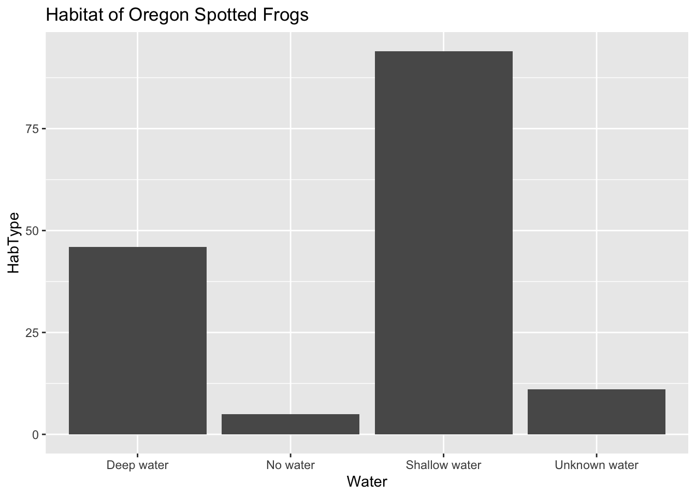

## Quarto

Quarto enables you to weave together content and executable code into a finished document. To learn more about Quarto see <https://quarto.org>.


::: {.cell}

```{.r .cell-code}
#Load the tidyverse
library(tidyverse)
```

::: {.cell-output .cell-output-stderr}

```
── Attaching core tidyverse packages ──────────────────────── tidyverse 2.0.0 ──
✔ dplyr     1.1.4     ✔ readr     2.1.5
✔ forcats   1.0.0     ✔ stringr   1.5.1
✔ ggplot2   3.5.1     ✔ tibble    3.2.1
✔ lubridate 1.9.4     ✔ tidyr     1.3.1
✔ purrr     1.0.4     
── Conflicts ────────────────────────────────────────── tidyverse_conflicts() ──
✖ dplyr::filter() masks stats::filter()
✖ dplyr::lag()    masks stats::lag()
ℹ Use the conflicted package (<http://conflicted.r-lib.org/>) to force all conflicts to become errors
```


:::

```{.r .cell-code}
frogs <- readr::read_csv('https://raw.githubusercontent.com/rfordatascience/tidytuesday/main/data/2022/2022-08-02/frogs.csv')
```

::: {.cell-output .cell-output-stderr}

```
Rows: 311 Columns: 16
── Column specification ────────────────────────────────────────────────────────
Delimiter: ","
chr (10): Site, Subsite, HabType, SurveyDate, Water, Type, Structure, Substr...
dbl  (6): Ordinal, Frequency, UTME_83, UTMN_83, Interval, Female

ℹ Use `spec()` to retrieve the full column specification for this data.
ℹ Specify the column types or set `show_col_types = FALSE` to quiet this message.
```


:::
:::

::: {.cell}

```{.r .cell-code}
#install.packages("tidymodels")
library(tidymodels)
```

::: {.cell-output .cell-output-stderr}

```
── Attaching packages ────────────────────────────────────── tidymodels 1.3.0 ──
```


:::

::: {.cell-output .cell-output-stderr}

```
✔ broom        1.0.8     ✔ rsample      1.3.0
✔ dials        1.4.0     ✔ tune         1.3.0
✔ infer        1.0.7     ✔ workflows    1.2.0
✔ modeldata    1.4.0     ✔ workflowsets 1.1.0
✔ parsnip      1.3.1     ✔ yardstick    1.3.2
✔ recipes      1.2.1     
```


:::

::: {.cell-output .cell-output-stderr}

```
── Conflicts ───────────────────────────────────────── tidymodels_conflicts() ──
✖ scales::discard() masks purrr::discard()
✖ dplyr::filter()   masks stats::filter()
✖ recipes::fixed()  masks stringr::fixed()
✖ dplyr::lag()      masks stats::lag()
✖ yardstick::spec() masks readr::spec()
✖ recipes::step()   masks stats::step()
```


:::

```{.r .cell-code}
my_data_splits <- initial_split(frogs, prop = 0.5)

exploratory_data <- training(my_data_splits)
test_data <- testing(my_data_splits)
```
:::


**Abstract**

In this analysis of Oregon Spotted Frog data from 2018, the habitats of female and male frogs are analyzed on what habitat allows them to flourish with the consideration of predators and external factors. There are different habitat types, water type, and type of land. With 156 observations and 16 variables, we are going to analyze 3 variables from the "test_data" and 309 observations and 16 variables from the "frogs" data set. This will allow us to understand the impact that different types of habitats have on Oregon Spotted Frogs.

**Introduction**

Oregon Spotted Frogs can be found in Southern Canada, along the Columbia River in Washington, and Klamath Valley in Oregon. Some were located in California but went extirpated and are no longer found in California. These frogs can range from 4.4-10.2 cm in length with the females tending to be larger than the males for reproductive purposes. They reproduce in late winter in river and ponds for about four weeks and females lay one egg mass which contains around 643 eggs. In the data set, Habitat Type, Water, and Type of land is analyzed to see which environment provides the best conditions for these frogs to thrive. The data was gathered by Tom Mock he observed the frogs being released into a pond, reservoir, and river and then tracked their movements. This can tell us how much they thrived in the habitats they encountered. There are two data sets that will be looked at which are "frogs" and "test_data". They each have different details about the environments that the frogs dwell in so we can better analyze which habitat is the favorite.

**Hypothesis**

My hypothesis is that the pond and river habitats are more suitable for Oregon Spotted Frogs rather than the reservoir. The frogs prefer going to shallow waters to lay eggs, I believe that ponds and rivers supply those factors.

**Exploratory Data**


::: {.cell}

```{.r .cell-code}
test_data %>%
  count(HabType)
```

::: {.cell-output .cell-output-stdout}

```
# A tibble: 3 × 2
  HabType       n
  <chr>     <int>
1 Pond         52
2 Reservoir    77
3 River        27
```


:::
:::


This cell explains how many different habitat types we are going to look at which are ponds, reservoirs, and rivers.


::: {.cell}

```{.r .cell-code}
test_data %>%
  count(HabType, Water)
```

::: {.cell-output .cell-output-stdout}

```
# A tibble: 11 × 3
   HabType   Water             n
   <chr>     <chr>         <int>
 1 Pond      Deep water       34
 2 Pond      No water          1
 3 Pond      Shallow water    13
 4 Pond      Unknown water     4
 5 Reservoir Deep water        7
 6 Reservoir No water          3
 7 Reservoir Shallow water    67
 8 River     Deep water        5
 9 River     No water          1
10 River     Shallow water    14
11 River     Unknown water     7
```


:::
:::


Within the habitat type, we can analyze the different variables which is the type of water being deep water, no water, shallow water, and unknown water.


::: {.cell}

```{.r .cell-code}
library(kableExtra)
```

::: {.cell-output .cell-output-stderr}

```

Attaching package: 'kableExtra'
```


:::

::: {.cell-output .cell-output-stderr}

```
The following object is masked from 'package:dplyr':

    group_rows
```


:::

```{.r .cell-code}
test_data %>%
  count(HabType, Water) %>%
  pivot_wider(names_from = Water, values_from = n, values_fill = 0) 
```

::: {.cell-output .cell-output-stdout}

```
# A tibble: 3 × 5
  HabType   `Deep water` `No water` `Shallow water` `Unknown water`
  <chr>            <int>      <int>           <int>           <int>
1 Pond                34          1              13               4
2 Reservoir            7          3              67               0
3 River                5          1              14               7
```


:::
:::


This breaks down further the type of water and the habitat type into separate columns with the specific count of areas that had deep water, no water, shallow water, and unknown.


::: {.cell}

```{.r .cell-code}
test_data %>%
  select(Water, HabType, Type, Female)
```

::: {.cell-output .cell-output-stdout}

```
# A tibble: 156 × 4
   Water         HabType   Type       Female
   <chr>         <chr>     <chr>       <dbl>
 1 Deep water    Pond      Marsh/Pond      0
 2 Deep water    Pond      Marsh/Pond      0
 3 Deep water    Pond      Marsh/Pond      0
 4 Deep water    Pond      Marsh/Pond      0
 5 Deep water    Pond      Marsh/Pond      0
 6 Shallow water Pond      Marsh/Pond      0
 7 Deep water    Pond      Marsh/Pond      0
 8 Shallow water Reservoir Reservoir       0
 9 Shallow water Reservoir Reservoir       0
10 Shallow water Reservoir Reservoir       0
# ℹ 146 more rows
```


:::
:::


This chart has similar comparisons with the addition if a female is present in the habitat which suggests better reproductive chances.


::: {.cell}

```{.r .cell-code}
test_data %>%  
ggplot() +
  geom_bar(mapping = aes(x = Water)) +
  labs(title ="Habitat of Oregon Spotted Frogs",
       x = "Water", y = "HabType")
```

::: {.cell-output-display}
{width=672}
:::
:::


In this bar graph, shallow water seems to be the favored water type among frogs. I think that deep water showed some results because frogs like swimming and adventuring there especially to gather vegetation or food. But shallow water was the popular spot because reproduction occurs there and day to day living because the frogs also like spending a good amount of time out of the water.

**Methodology**

In this methodology, we analyze the "frogs" data set. The first analysis was on the main data set was from "test_data" which had 156 observations where "frogs" data set had 309 observations. They each analyzed different aspects of the frog's environment such as the type of water, type of land, and type of vegetation which was named "Open" in the Frogs data set. "Open" describes the type of vegetation within the environment which can either help or effect the frogs negatively. The variable "Subsite" organizes the specific location on the river, pond or reservoir where the data was gathered.

In the Exploratory Data section, Habitat Type, Water Type, and amount of females was compared and contrasted. In Habitat Type, included ponds, reservoirs, and rivers. Water type was deep water, shallow water, or no water. There was a section called "Type" that gave more detail about the type of water such as marsh/pond. The data overall was very detailed enough to really give us the picture of what kind of environments these frogs were dwelling in.


::: {.cell}

```{.r .cell-code}
frogs %>%
  count(Structure)
```

::: {.cell-output .cell-output-stdout}

```
# A tibble: 5 × 2
  Structure          n
  <chr>          <int>
1 Herbaceous veg   201
2 Leaf litter        2
3 Open              38
4 Woody debris      65
5 Woody veg          5
```


:::
:::


This data set is from "frogs" which gives a little more detail for the environment studied, in this case its Herbaceous vegetation, leaf litter, open area, woody debris, and woody vegetation. This showed a lot of herbaceous vegetation with some woody debris which is common in all aquatic environments.


::: {.cell}

```{.r .cell-code}
frogs %>%
  count(Subsite)
```

::: {.cell-output .cell-output-stdout}

```
# A tibble: 6 × 2
  Subsite            n
  <chr>          <int>
1 Cow Camp Pond     14
2 Cow Camp River    38
3 N Res             83
4 NE Res            17
5 SE Pond           81
6 W Res             78
```


:::
:::


Subsite shows the specific location of these aquatic areas broken into 6 categories which are cow camp ponds, cow camp river, north reservoir, north east reservoir, southeast pond, and west reservoir.


::: {.cell}

```{.r .cell-code}
frogs %>%
  count(Structure, Subsite) %>%
  pivot_wider(names_from = Structure, values_from = n, values_fill = 0)
```

::: {.cell-output .cell-output-stdout}

```
# A tibble: 6 × 6
  Subsite        `Herbaceous veg` `Leaf litter`  Open `Woody debris` `Woody veg`
  <chr>                     <int>         <int> <int>          <int>       <int>
1 Cow Camp Pond                 7             0     1              6           0
2 Cow Camp River               23             1     8              4           2
3 N Res                        54             0     8             20           1
4 NE Res                       14             0     3              0           0
5 SE Pond                      43             0    14             23           1
6 W Res                        60             1     4             12           1
```


:::
:::


This chart puts together subsite and the open type and the count of how many structures were within the different subsites. Herbaceous vegetation was popular in the North and West Reservoirs and woody debris was also plentiful in those reservoirs.

**Conclusion**

The Oregon Spotted Frog was proven to love reservoirs because of the vast area and more controlled space from people and other predatory factors. However, the frogs also liked ponds but because of the smaller area, there was more competition which isn't as favored or a harmonious environment compared to reservoirs. This invalidates my hypothesis about frogs preferring ponds or rivers although there was a lot of data gathered from pond regions. We can tell this because there was plentiful amount of data gathered from reservoir regions which can indicate the preferred habitat type which includes herbaceous vegetation areas as well. Shallow water also had lots of data as we can see on the bar chart, this would seem accurate because frogs biologically go up for air at some point and lay eggs and mate in shallow waters. There were only females that were listed in the charts which leaves the question of are the 0's males or it wasn't recorded. However, the amount of females in an area is the most important because of reproduction. The Oregon Spotted Frog can really live in any aquatic environment with vegetation, but after this analysis, reservoirs with herbaceous vegetation and shallow water are the best conditions for this frog to flourish.
