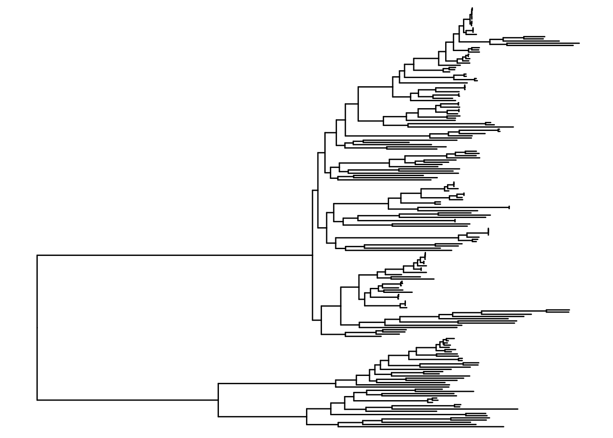
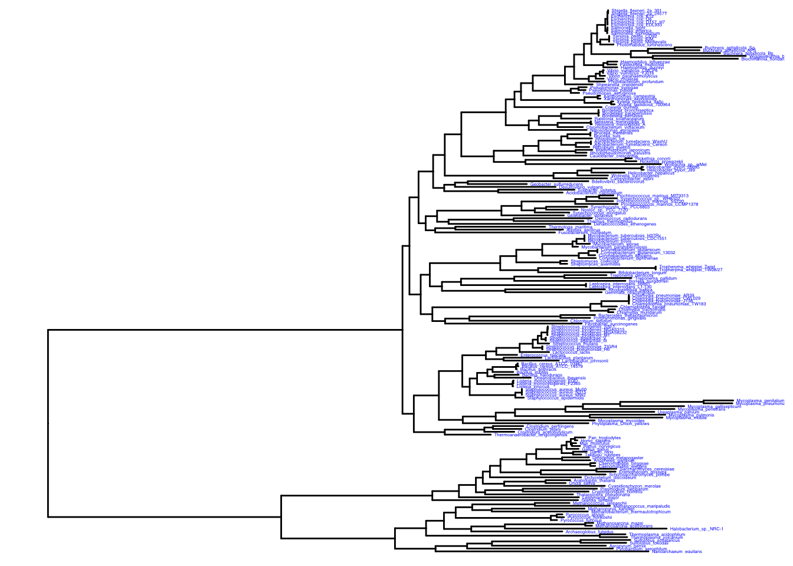
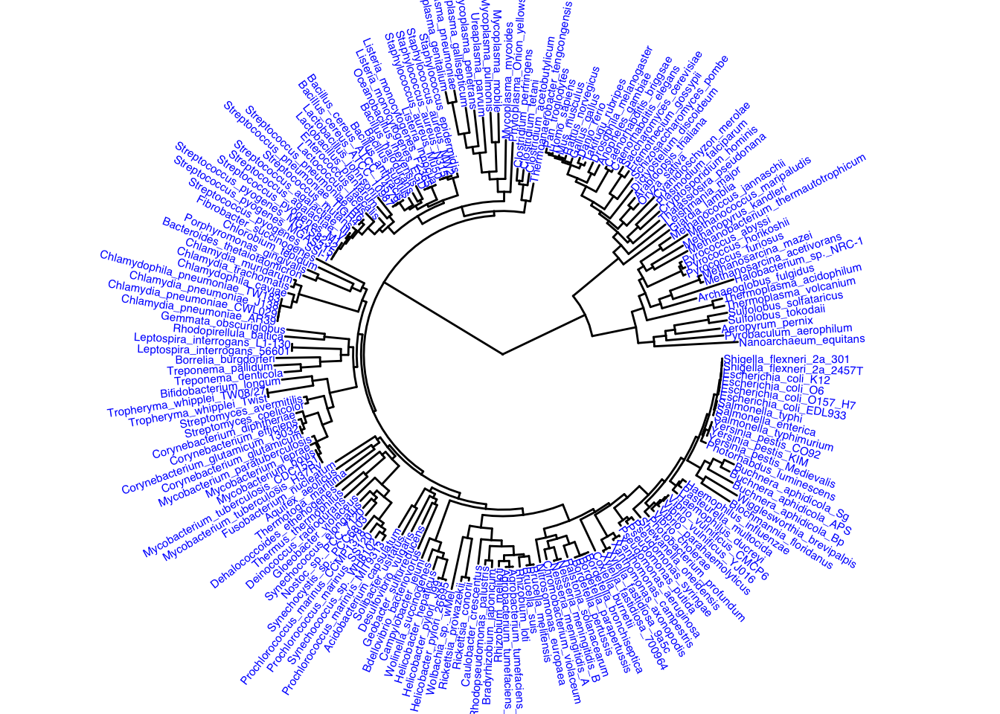

::: {.cell}

```{.r .cell-code}
#install.packages("ape")

#if (!require("BiocManager", quietly = TRUE))
    #install.packages("BiocManager")

#BiocManager::install("treeio")

#if (!require("BiocManager", quietly = TRUE))
    #install.packages("BiocManager")

#BiocManager::install("ggtree")

#if (!require("BiocManager", quietly = TRUE))
    #install.packages("BiocManager")

#BiocManager::install("SGSeq")
```
:::

::: {.cell}

```{.r .cell-code}
library(rbioinfcookbook)
library(SGSeq)
```

::: {.cell-output .cell-output-stderr}

```
Loading required package: IRanges
```


:::

::: {.cell-output .cell-output-stderr}

```
Loading required package: BiocGenerics
```


:::

::: {.cell-output .cell-output-stderr}

```

Attaching package: 'BiocGenerics'
```


:::

::: {.cell-output .cell-output-stderr}

```
The following objects are masked from 'package:stats':

    IQR, mad, sd, var, xtabs
```


:::

::: {.cell-output .cell-output-stderr}

```
The following objects are masked from 'package:base':

    anyDuplicated, aperm, append, as.data.frame, basename, cbind,
    colnames, dirname, do.call, duplicated, eval, evalq, Filter, Find,
    get, grep, grepl, intersect, is.unsorted, lapply, Map, mapply,
    match, mget, order, paste, pmax, pmax.int, pmin, pmin.int,
    Position, rank, rbind, Reduce, rownames, sapply, saveRDS, setdiff,
    table, tapply, union, unique, unsplit, which.max, which.min
```


:::

::: {.cell-output .cell-output-stderr}

```
Loading required package: S4Vectors
```


:::

::: {.cell-output .cell-output-stderr}

```
Loading required package: stats4
```


:::

::: {.cell-output .cell-output-stderr}

```

Attaching package: 'S4Vectors'
```


:::

::: {.cell-output .cell-output-stderr}

```
The following object is masked from 'package:utils':

    findMatches
```


:::

::: {.cell-output .cell-output-stderr}

```
The following objects are masked from 'package:base':

    expand.grid, I, unname
```


:::

::: {.cell-output .cell-output-stderr}

```
Loading required package: GenomicRanges
```


:::

::: {.cell-output .cell-output-stderr}

```
Loading required package: GenomeInfoDb
```


:::

::: {.cell-output .cell-output-stderr}

```
Loading required package: Rsamtools
```


:::

::: {.cell-output .cell-output-stderr}

```
Loading required package: Biostrings
```


:::

::: {.cell-output .cell-output-stderr}

```
Loading required package: XVector
```


:::

::: {.cell-output .cell-output-stderr}

```

Attaching package: 'Biostrings'
```


:::

::: {.cell-output .cell-output-stderr}

```
The following object is masked from 'package:base':

    strsplit
```


:::

::: {.cell-output .cell-output-stderr}

```
Loading required package: SummarizedExperiment
```


:::

::: {.cell-output .cell-output-stderr}

```
Loading required package: MatrixGenerics
```


:::

::: {.cell-output .cell-output-stderr}

```
Loading required package: matrixStats
```


:::

::: {.cell-output .cell-output-stderr}

```

Attaching package: 'MatrixGenerics'
```


:::

::: {.cell-output .cell-output-stderr}

```
The following objects are masked from 'package:matrixStats':

    colAlls, colAnyNAs, colAnys, colAvgsPerRowSet, colCollapse,
    colCounts, colCummaxs, colCummins, colCumprods, colCumsums,
    colDiffs, colIQRDiffs, colIQRs, colLogSumExps, colMadDiffs,
    colMads, colMaxs, colMeans2, colMedians, colMins, colOrderStats,
    colProds, colQuantiles, colRanges, colRanks, colSdDiffs, colSds,
    colSums2, colTabulates, colVarDiffs, colVars, colWeightedMads,
    colWeightedMeans, colWeightedMedians, colWeightedSds,
    colWeightedVars, rowAlls, rowAnyNAs, rowAnys, rowAvgsPerColSet,
    rowCollapse, rowCounts, rowCummaxs, rowCummins, rowCumprods,
    rowCumsums, rowDiffs, rowIQRDiffs, rowIQRs, rowLogSumExps,
    rowMadDiffs, rowMads, rowMaxs, rowMeans2, rowMedians, rowMins,
    rowOrderStats, rowProds, rowQuantiles, rowRanges, rowRanks,
    rowSdDiffs, rowSds, rowSums2, rowTabulates, rowVarDiffs, rowVars,
    rowWeightedMads, rowWeightedMeans, rowWeightedMedians,
    rowWeightedSds, rowWeightedVars
```


:::

::: {.cell-output .cell-output-stderr}

```
Loading required package: Biobase
```


:::

::: {.cell-output .cell-output-stderr}

```
Welcome to Bioconductor

    Vignettes contain introductory material; view with
    'browseVignettes()'. To cite Bioconductor, see
    'citation("Biobase")', and for packages 'citation("pkgname")'.
```


:::

::: {.cell-output .cell-output-stderr}

```

Attaching package: 'Biobase'
```


:::

::: {.cell-output .cell-output-stderr}

```
The following object is masked from 'package:MatrixGenerics':

    rowMedians
```


:::

::: {.cell-output .cell-output-stderr}

```
The following objects are masked from 'package:matrixStats':

    anyMissing, rowMedians
```


:::

```{.r .cell-code}
library(ape)
```

::: {.cell-output .cell-output-stderr}

```

Attaching package: 'ape'
```


:::

::: {.cell-output .cell-output-stderr}

```
The following object is masked from 'package:Biostrings':

    complement
```


:::

```{.r .cell-code}
library(treeio)
```

::: {.cell-output .cell-output-stderr}

```
treeio v1.30.0 Learn more at https://yulab-smu.top/contribution-tree-data/

Please cite:

LG Wang, TTY Lam, S Xu, Z Dai, L Zhou, T Feng, P Guo, CW Dunn, BR
Jones, T Bradley, H Zhu, Y Guan, Y Jiang, G Yu. treeio: an R package
for phylogenetic tree input and output with richly annotated and
associated data. Molecular Biology and Evolution. 2020, 37(2):599-603.
doi: 10.1093/molbev/msz240
```


:::

::: {.cell-output .cell-output-stderr}

```

Attaching package: 'treeio'
```


:::

::: {.cell-output .cell-output-stderr}

```
The following object is masked from 'package:Biostrings':

    mask
```


:::

```{.r .cell-code}
library(ggplot2)
```

::: {.cell-output .cell-output-stderr}

```

Attaching package: 'ggplot2'
```


:::

::: {.cell-output .cell-output-stderr}

```
The following object is masked from 'package:SGSeq':

    annotate
```


:::

```{.r .cell-code}
library(ggtree)
```

::: {.cell-output .cell-output-stderr}

```
ggtree v3.14.0 Learn more at https://yulab-smu.top/contribution-tree-data/

Please cite:

Guangchuang Yu, Tommy Tsan-Yuk Lam, Huachen Zhu, Yi Guan. Two methods
for mapping and visualizing associated data on phylogeny using ggtree.
Molecular Biology and Evolution. 2018, 35(12):3041-3043.
doi:10.1093/molbev/msy194
```


:::

::: {.cell-output .cell-output-stderr}

```

Attaching package: 'ggtree'
```


:::

::: {.cell-output .cell-output-stderr}

```
The following object is masked from 'package:ape':

    rotate
```


:::

::: {.cell-output .cell-output-stderr}

```
The following object is masked from 'package:Biostrings':

    collapse
```


:::

::: {.cell-output .cell-output-stderr}

```
The following object is masked from 'package:IRanges':

    collapse
```


:::

::: {.cell-output .cell-output-stderr}

```
The following object is masked from 'package:S4Vectors':

    expand
```


:::
:::

::: {.cell}

```{.r .cell-code}
newick_file_path <- fs::path_package("extdata", "mammal_tree.nwk", package = "rbioinfcookbook" )

nexus_file_path <- fs::path_package("extdata", "mammal_tree.nexus", package = "rbioinfcookbook")

newick <- ape::read.tree(newick_file_path)
nexus <- ape::read.nexus(nexus_file_path)
```
:::

::: {.cell}

```{.r .cell-code}
beast_file_path <- fs::path_package("extdata", "beast_mcc.tree", package = "rbioinfcookbook")

raxml_file_path <- fs::path_package("extdata", "RAxML_bipartitionsBranchLabels.H3", package = "rbioinfcookbook")

beast <- read.beast(beast_file_path)
raxml <- read.raxml(raxml_file_path)
```
:::

::: {.cell}

```{.r .cell-code}
beast_phylo <- treeio::as.phylo(beast)
newick_tidytree <- treeio::as.treedata(newick)
```
:::

::: {.cell}

```{.r .cell-code}
treeio::write.beast(newick_tidytree, file = "mammal_tree.beast")
ape::write.nexus(beast_phylo, file = "beast_mcc.nexus")
```
:::

::: {.cell}

```{.r .cell-code}
tree_file <- fs::path_package("extdata", "itol.nwk", package = "rbioinfcookbook")

itol<- ape::read.tree(tree_file)
```
:::

::: {.cell}

```{.r .cell-code}
ggtree(itol)
```

::: {.cell-output-display}
{width=672}
:::
:::

::: {.cell}

```{.r .cell-code}
ggtree(itol) +
  geom_tiplab(color = "blue", size = 1)
```

::: {.cell-output-display}
{width=672}
:::
:::

::: {.cell}

```{.r .cell-code}
ggtree(itol, layout = "circular") +
  geom_tiplab(color = "blue", size = 2)
```

::: {.cell-output-display}
{width=672}
:::
:::
