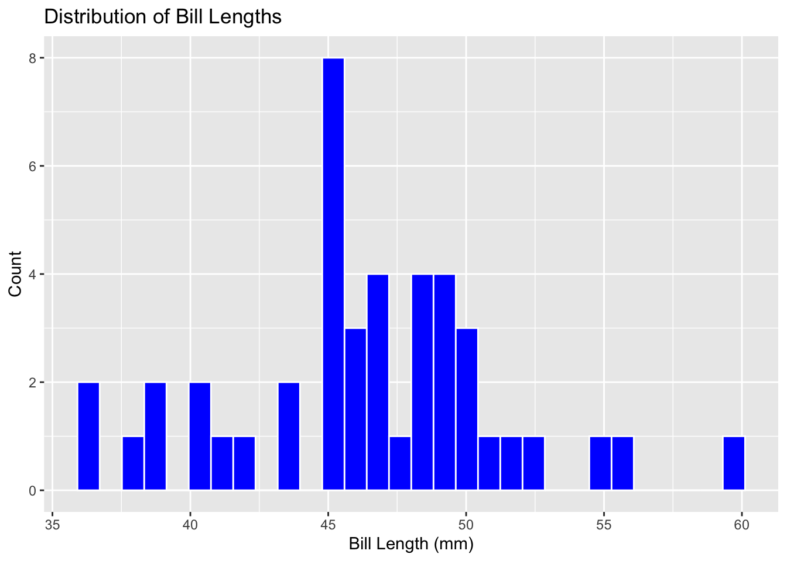
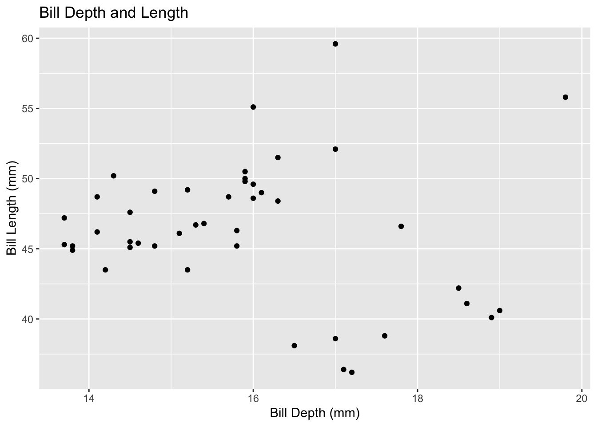
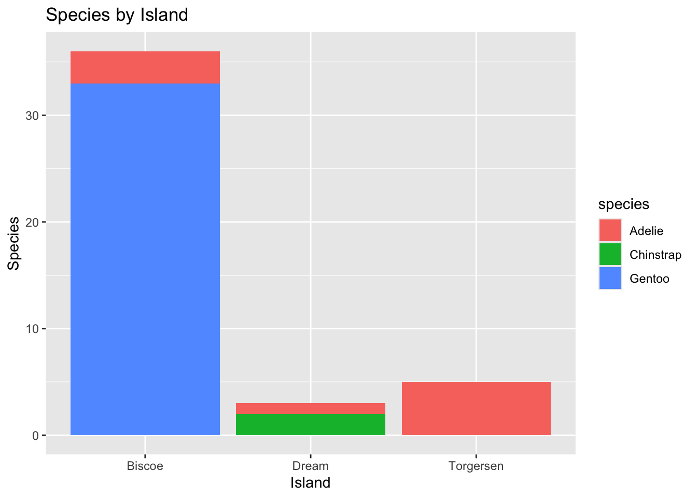
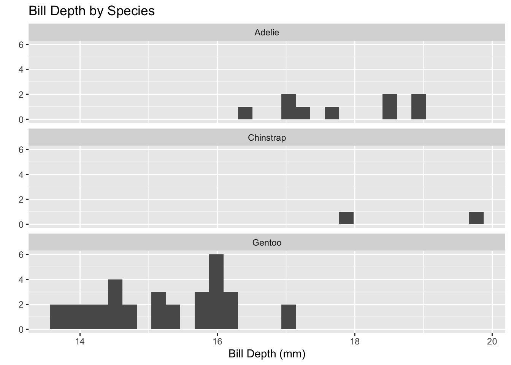

## Palmer Penguins

Penguins


::: {.cell}

```{.r .cell-code}
#Load the tidyverse
library(tidyverse)
```

::: {.cell-output .cell-output-stderr}

```
── Attaching core tidyverse packages ──────────────────────── tidyverse 2.0.0 ──
✔ dplyr     1.1.4     ✔ readr     2.1.5
✔ forcats   1.0.0     ✔ stringr   1.5.1
✔ ggplot2   3.5.1     ✔ tibble    3.2.1
✔ lubridate 1.9.4     ✔ tidyr     1.3.1
✔ purrr     1.0.2     
── Conflicts ────────────────────────────────────────── tidyverse_conflicts() ──
✖ dplyr::filter() masks stats::filter()
✖ dplyr::lag()    masks stats::lag()
ℹ Use the conflicted package (<http://conflicted.r-lib.org/>) to force all conflicts to become errors
```


:::

```{.r .cell-code}
#Read the penguins_samp1 data file from github
penguins <- read_csv("https://raw.githubusercontent.com/mcduryea/Intro-to-Bioinformatics/main/data/penguins_samp1.csv")
```

::: {.cell-output .cell-output-stderr}

```
Rows: 44 Columns: 8
── Column specification ────────────────────────────────────────────────────────
Delimiter: ","
chr (3): species, island, sex
dbl (5): bill_length_mm, bill_depth_mm, flipper_length_mm, body_mass_g, year

ℹ Use `spec()` to retrieve the full column specification for this data.
ℹ Specify the column types or set `show_col_types = FALSE` to quiet this message.
```


:::

```{.r .cell-code}
#See the first six rows of the data we've read in to our notebook
penguins %>% head()
```

::: {.cell-output .cell-output-stdout}

```
# A tibble: 6 × 8
  species island bill_length_mm bill_depth_mm flipper_length_mm body_mass_g
  <chr>   <chr>           <dbl>         <dbl>             <dbl>       <dbl>
1 Gentoo  Biscoe           59.6          17                 230        6050
2 Gentoo  Biscoe           48.6          16                 230        5800
3 Gentoo  Biscoe           52.1          17                 230        5550
4 Gentoo  Biscoe           51.5          16.3               230        5500
5 Gentoo  Biscoe           55.1          16                 230        5850
6 Gentoo  Biscoe           49.8          15.9               229        5950
# ℹ 2 more variables: sex <chr>, year <dbl>
```


:::
:::


This is a table of species of penguins and the island they live on and comparing their bill length, bill depth, and flipper length, body mass, and sex. They all are the same species and live on the same island and their bills are all similar in measurement since they are all males.

## Data Manipulation

We’ll be learning how to use R code to manipulate data in this section. In particular, we’ll learn how to filter rows, subset columns, group data, and compute summary statistics.


::: {.cell}

```{.r .cell-code}
penguins %>%
  count(island)
```

::: {.cell-output .cell-output-stdout}

```
# A tibble: 3 × 2
  island        n
  <chr>     <int>
1 Biscoe       36
2 Dream         3
3 Torgersen     5
```


:::
:::

::: {.cell}

```{.r .cell-code}
penguins %>%
  count(island, species) %>%
  pivot_wider(names_from = species, values_from = n, values_fill = 0)
```

::: {.cell-output .cell-output-stdout}

```
# A tibble: 3 × 4
  island    Adelie Gentoo Chinstrap
  <chr>      <int>  <int>     <int>
1 Biscoe         3     33         0
2 Dream          1      0         2
3 Torgersen      5      0         0
```


:::
:::

::: {.cell}

```{.r .cell-code}
penguins %>% count(island, species)
```

::: {.cell-output .cell-output-stdout}

```
# A tibble: 5 × 3
  island    species       n
  <chr>     <chr>     <int>
1 Biscoe    Adelie        3
2 Biscoe    Gentoo       33
3 Dream     Adelie        1
4 Dream     Chinstrap     2
5 Torgersen Adelie        5
```


:::
:::

::: {.cell}

```{.r .cell-code}
library(kableExtra)
```

::: {.cell-output .cell-output-stderr}

```

Attaching package: 'kableExtra'
```


:::

::: {.cell-output .cell-output-stderr}

```
The following object is masked from 'package:dplyr':

    group_rows
```


:::

```{.r .cell-code}
penguins %>%
  count(island, species) %>%
  pivot_wider(names_from = species, values_from = n, values_fill = 0) %>%
  kable() %>%
  kable_styling(bootstrap_options = c("hover", "striped"))
```

::: {.cell-output-display}

`````{=html}
<table class="table table-hover table-striped" style="margin-left: auto; margin-right: auto;">
 <thead>
  <tr>
   <th style="text-align:left;"> island </th>
   <th style="text-align:right;"> Adelie </th>
   <th style="text-align:right;"> Gentoo </th>
   <th style="text-align:right;"> Chinstrap </th>
  </tr>
 </thead>
<tbody>
  <tr>
   <td style="text-align:left;"> Biscoe </td>
   <td style="text-align:right;"> 3 </td>
   <td style="text-align:right;"> 33 </td>
   <td style="text-align:right;"> 0 </td>
  </tr>
  <tr>
   <td style="text-align:left;"> Dream </td>
   <td style="text-align:right;"> 1 </td>
   <td style="text-align:right;"> 0 </td>
   <td style="text-align:right;"> 2 </td>
  </tr>
  <tr>
   <td style="text-align:left;"> Torgersen </td>
   <td style="text-align:right;"> 5 </td>
   <td style="text-align:right;"> 0 </td>
   <td style="text-align:right;"> 0 </td>
  </tr>
</tbody>
</table>

`````

:::
:::

::: {.cell}

```{.r .cell-code}
penguins %>%
  summarize(mean_bill_length_mm = mean(bill_length_mm))
```

::: {.cell-output .cell-output-stdout}

```
# A tibble: 1 × 1
  mean_bill_length_mm
                <dbl>
1                46.4
```


:::
:::

::: {.cell}

```{.r .cell-code}
penguins %>%
  summarize(mean_bill_length_mm = mean(bill_length_mm, na.rm = TRUE))
```

::: {.cell-output .cell-output-stdout}

```
# A tibble: 1 × 1
  mean_bill_length_mm
                <dbl>
1                46.4
```


:::
:::

::: {.cell}

```{.r .cell-code}
penguins %>%
  summarize(
    min_bill_length = min(bill_length_mm, na.rm = TRUE),
    first_quartile_bill_length = quantile(bill_length_mm, 0.25, na.rm = TRUE),
    median_bill_length = median(bill_length_mm, na.rm = TRUE),
    mean_bill_length_mm = mean(bill_length_mm, na.rm = TRUE),
    third_quartile_bill_length = quantile(bill_length_mm, 0.75, na.rm = TRUE),
    standard_deviation_bill_length = sd(bill_length_mm, na.rm = TRUE)
    ) %>%
  pivot_longer(cols = everything())
```

::: {.cell-output .cell-output-stdout}

```
# A tibble: 6 × 2
  name                           value
  <chr>                          <dbl>
1 min_bill_length                36.2 
2 first_quartile_bill_length     44.6 
3 median_bill_length             46.4 
4 mean_bill_length_mm            46.4 
5 third_quartile_bill_length     49.1 
6 standard_deviation_bill_length  4.93
```


:::
:::

::: {.cell}

```{.r .cell-code}
penguins %>%
  select(species, island, sex, year)
```

::: {.cell-output .cell-output-stdout}

```
# A tibble: 44 × 4
   species island sex    year
   <chr>   <chr>  <chr> <dbl>
 1 Gentoo  Biscoe male   2007
 2 Gentoo  Biscoe male   2008
 3 Gentoo  Biscoe male   2009
 4 Gentoo  Biscoe male   2009
 5 Gentoo  Biscoe male   2009
 6 Gentoo  Biscoe male   2009
 7 Gentoo  Biscoe male   2008
 8 Gentoo  Biscoe male   2009
 9 Gentoo  Biscoe male   2008
10 Gentoo  Biscoe male   2007
# ℹ 34 more rows
```


:::
:::

::: {.cell}

```{.r .cell-code}
penguins %>%
  select(species, island, sex, year) %>%
  filter(species == "Chinstrap")
```

::: {.cell-output .cell-output-stdout}

```
# A tibble: 2 × 4
  species   island sex     year
  <chr>     <chr>  <chr>  <dbl>
1 Chinstrap Dream  male    2009
2 Chinstrap Dream  female  2007
```


:::
:::

::: {.cell}

```{.r .cell-code}
chinstraps <- penguins %>%
  select(species, island, sex, year) %>%
  filter(species == "Chinstrap") %>%
  select(-species)

chinstraps %>%
  head()
```

::: {.cell-output .cell-output-stdout}

```
# A tibble: 2 × 3
  island sex     year
  <chr>  <chr>  <dbl>
1 Dream  male    2009
2 Dream  female  2007
```


:::
:::

::: {.cell}

```{.r .cell-code}
penguins %>%
  group_by(species) %>%
  summarise(
    mean_bill_depth_mm = mean(bill_depth_mm, na.rm = TRUE),
    sd_bill_depth_mm = sd(bill_depth_mm, na.rm = TRUE)
  )
```

::: {.cell-output .cell-output-stdout}

```
# A tibble: 3 × 3
  species   mean_bill_depth_mm sd_bill_depth_mm
  <chr>                  <dbl>            <dbl>
1 Adelie                  17.8            0.935
2 Chinstrap               18.8            1.41 
3 Gentoo                  15.2            0.951
```


:::
:::

::: {.cell}

```{.r .cell-code}
penguins %>%
  ggplot() +
  geom_bar(mapping = aes(x = species)) +
  labs(title ="Counts of Penguin Species",
       x = "Species", y = "Count")
```

::: {.cell-output-display}
{width=672}
:::
:::


This chart represents the count of penguins with relevance to three different species of penguins. The Gentoo has the most amount which its above 30, compared to Adelie and Chinstrap penguins which are below ten.


::: {.cell}

```{.r .cell-code}
penguins %>%
  ggplot() +
  geom_histogram(mapping = aes(x = bill_length_mm),
                 color = "white",
                 fill = "blue") +
  labs(title ="Distribution of Bill Lengths",
       x = "Bill Length (mm)", y = "Count")
```

::: {.cell-output .cell-output-stderr}

```
`stat_bin()` using `bins = 30`. Pick better value with `binwidth`.
```


:::

::: {.cell-output-display}
{width=672}
:::
:::


By observing the bar graph, we can see that the average bill length is about 45-47mm long. The other bill lengths averaged 4 and below.


::: {.cell}

```{.r .cell-code}
penguins %>%
  ggplot() +
  geom_point(mapping = aes(x = bill_depth_mm, y = bill_length_mm)) +
  labs(title = "Bill Depth and Length",
       x = "Bill Depth (mm)",
       y = "Bill Length (mm)")
```

::: {.cell-output-display}
{width=672}
:::
:::


This graph shows that every bill length with bill depth is different.


::: {.cell}

```{.r .cell-code}
penguins %>%
  ggplot() +
  geom_bar(mapping = aes(x = island, fill = species)) +
  labs(title = "Species by Island",
       x = "Island",
       y = "Species")
```

::: {.cell-output-display}
{width=672}
:::
:::


There are a bountiful amount of Genetoo penguins on the Biscoe Island compared to the other islands with not that many penguins on them. The Adelie penguins though live on each of the islands and Chinstrap penguins only live on Dream Island.


::: {.cell}

```{.r .cell-code}
penguins %>%
  ggplot() +
  geom_boxplot(mapping = aes(x = bill_depth_mm, y = species)) +
  labs(title = "Bill Depth by Species",
       x = "Bill Depth (mm)",
       y = "")
```

::: {.cell-output-display}
{width=672}
:::
:::

::: {.cell}

```{.r .cell-code}
penguins %>%
  ggplot() +
  geom_histogram(mapping = aes(x = bill_depth_mm)) +
  facet_wrap(~species, ncol = 1) +
  labs(title = "Bill Depth by Species",
       x = "Bill Depth (mm)",
       y = "")
```

::: {.cell-output .cell-output-stderr}

```
`stat_bin()` using `bins = 30`. Pick better value with `binwidth`.
```


:::

::: {.cell-output-display}
{width=672}
:::
:::


The bill depth on the Adelie penguins are deeper than Gentoo. Chinstrap however have 1 thats the length of 18mm and 19mm long. Gentoo has a bill length of below 18mm.


::: {.cell}

```{.r .cell-code}
penguins %>%
  filter(!is.na(sex)) %>%
  ggplot() +
  geom_point(mapping = aes(x = bill_length_mm, 
                           y = flipper_length_mm,
                           color = species,
                           shape = sex)) +
  geom_smooth(mapping = aes(x = bill_length_mm,
                            y = flipper_length_mm,
                            color = species),
              method = "lm") +
  facet_grid(island ~ sex, scales = "free") +
  labs(title = "Flipper and Bill Lengths by Species and Sex",
       x = "Bill Length (mm)",
       y = "Flipper Length(mm)") +
  theme_light()
```

::: {.cell-output .cell-output-stderr}

```
`geom_smooth()` using formula = 'y ~ x'
```


:::

::: {.cell-output .cell-output-stderr}

```
Warning in qt((1 - level)/2, df): NaNs produced
Warning in qt((1 - level)/2, df): NaNs produced
```


:::

::: {.cell-output .cell-output-stderr}

```
Warning in max(ids, na.rm = TRUE): no non-missing arguments to max; returning
-Inf
Warning in max(ids, na.rm = TRUE): no non-missing arguments to max; returning
-Inf
```


:::

::: {.cell-output-display}
{width=672}
:::
:::


The bill length of a male and female penguin do exceed 45mm because the lines on the graph keep progressing forward.
